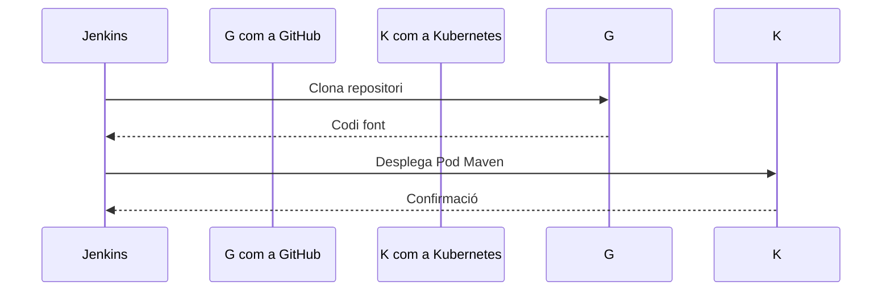
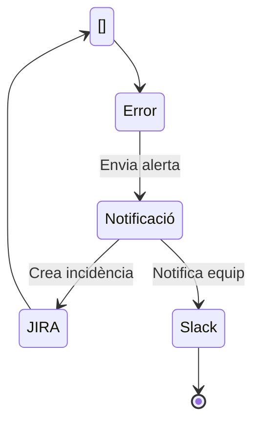

# Pipeline d'Integració Contínua MAT { .md-typeset }

{ align=right width="300" }

## Descripció General
Aquest pipeline Jenkins automatitza l'execució de proves funcionals integrat al Marc d'Automatització de Testing (MAT) del CTTI.

<div class="grid cards" markdown>

-   :material-git: __Integració amb GitHub__
-   :material-jira: __Sincronització amb JIRA__
-   :material-chart-line: __Mètriques en temps real__
-   :material-shield-check: __Quality Gates Integrats__

</div>

## Diagrama del Flux


## Paràmetres del Pipeline

| Paràmetre | Descripció | Valors Permesos |
|-----------|------------|-----------------|
| `REPO_URL` | Repositori de proves | URL GitHub vàlida |
| `ENV_TO_TEST` | Entorn de proves | Desenvolupament, Integració, Preproducció, Producció |
| `BRANCH` | Branca a provar | Nom de branca vàlid |
| `QUALITY_GATE` | Control de qualitat | true/false |

## Etapes Principals

### 1. Configuració Inicial


### 2. Execució de Proves
??? tip "Tecnologies Utilitzades"
    - Selenium per a proves funcionals
    - Maven com a gestor de dependències
    - Allure per a informes executives

```
container('maven') {
sh '''
mvn clean test
-Dbuild_id=${BUILD_NUMBER}
-Denvironment=${params.ENV_TO_TEST}
'''
}
```

### 3. Gestió de Resultats

| Eina | Funció | Integració |
|------|--------|------------|
| JIRA | Pujada de resultats | Xray Test Management |
| GitHub | Vinculació a PRs | Comentaris automàtics |
| InfluxDB | Emmagatzematge mètriques | Grafana Dashboards |

## Qualitat i Seguretat

!!! danger "Control d'Errors"
    El pipeline inclou mecanismes avançats de gestió d'errors:
    - Validació de tickets JIRA
    - Avaluació de llindars d'error
    - Notificacions multi-canal



## Mètriques Clau
```
{
"$schema": "https://vega.github.io/schema/vega-lite/v5.json",
"description": "Mètriques d'Execució",
"data": {
"values": [
{"metric": "Temps Execució", "value": 15, "unit": "min"},
{"metric": "Proves Exitoses", "value": 95, "unit": "%"},
{"metric": "Coverage", "value": 85, "unit": "%"}
]
},
"mark": "bar",
"encoding": {
"x": {"field": "metric", "type": "nominal", "axis": {"labelAngle": 0}},
"y": {"field": "value", "type": "quantitative"},
"color": {"field": "metric", "legend": null}
}
}
```

## Integració amb Ecosistema MAT

<div class="grid cards" markdown>

-   [Documentació Tècnica](https://ctti.gencat.cat/mat-docs){ .md-button }
-   [Exemples d'Implementació](../examples){ .md-button }
-   [Guia de Troubleshooting](../troubleshooting){ .md-button }

</div>
