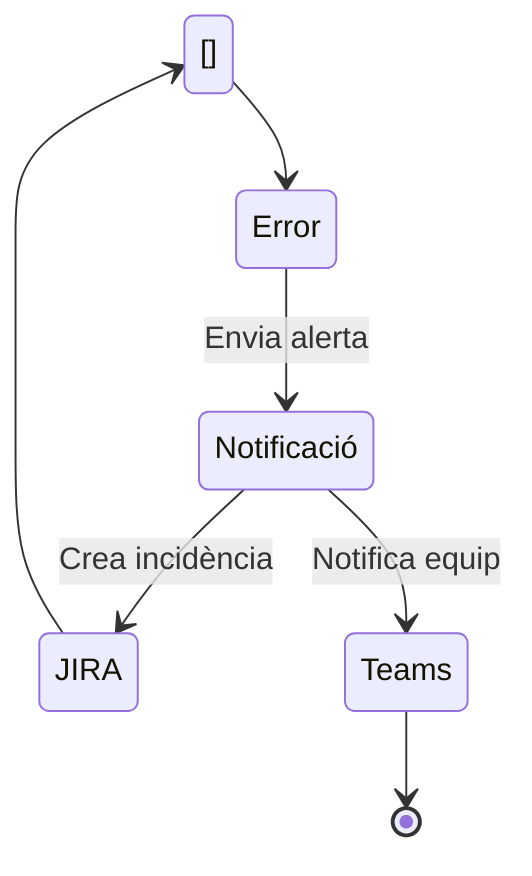

# Pipeline d'Integració Contínua MAT { .md-typeset }

{ align=right width="300" }

## Descripció General
Aquest pipeline Jenkins automatitza l'execució de proves funcionals integrat al Marc d'Automatització de Testing (MAT) del CTTI.

<div class="grid cards" markdown>

-   :material-git: __Integració amb GitHub__
-   :material-jira: __Sincronització amb JIRA__
-   :material-chart-line: __Mètriques en temps real__
-   :material-shield-check: __Quality Gates Integrats__

</div>

## Diagrama del Flux


## Paràmetres del Pipeline

| Paràmetre | Descripció | Valors Permesos |
|-----------|------------|-----------------|
| `REPO_URL` | Repositori de proves | URL GitHub vàlida |
| `ENV_TO_TEST` | Entorn de proves | Desenvolupament, Integració, Preproducció, Producció |
| `BRANCH` | Branca a provar | Nom de branca vàlid |
| `QUALITY_GATE` | Control de qualitat | true/false |

## Etapes Principals

### 1. Configuració Inicial
```mermaid
flowchart TD
    A[Inicio Pipeline] --> B[Validar Issue en JIRA]
    B --> C[Checkout del Repositorio]
    C --> D[Ejecutar Pruebas]
    D --> E[Convertir Reporte HTML a Markdown]
    E --> F[Subir Resultados a JIRA]
    F --> G[Publicar Reporte HTML en Jenkins]
    G --> H[Subir Reporte a JIRA]
    H --> I[Adjuntar Reporte Markdown a GitHub (Pull Request)]
    I --> J[Evaluar Umbral (Quality Gate)]
    J --> K[Fin Pipeline]
```

### 2. Execució de Proves
??? tip "Tecnologies Utilitzades"
    - Selenium per a proves funcionals
    - Maven com a gestor de dependències
    - Extent per a informes executives

```mermaid
flowchart LR
    subgraph Validaciones_Iniciales [Validaciones Iniciales]
        A1[Verificar Parámetros Obligatorios]
        A2[Validar Issue en JIRA]
        A1 --> A2
    end

    subgraph Ejecución_Pruebas [Ejecución de Pruebas]
        B1[Checkout del Repositorio]
        B2[Ejecutar Pruebas con Maven]
        B3[Convertir HTML a Markdown]
        B1 --> B2
        B2 --> B3
    end

    subgraph Reportes [Publicación de Reportes]
        C1[Subir Resultados a JIRA]
        C2[Publicar Reporte HTML en Jenkins]
        C3[Subir Reporte Comprimido a JIRA]
        C4[Adjuntar Markdown a Pull Request de GitHub]
        C1 --> C2
        C2 --> C3
        C3 --> C4
    end

    subgraph Evaluación [Evaluación de Calidad]
        D1[Evaluar Umbral (Quality Gate)]
    end

    Validaciones_Iniciales --> Ejecución_Pruebas
    Ejecución_Pruebas --> Reportes
    Reportes --> Evaluación
```

### 3. Gestió de Resultats

| Eina | Funció | Integració |
|------|--------|------------|
| JIRA | Pujada de resultats | Xray Test Management |
| GitHub | Vinculació a PRs | Comentaris automàtics |
| InfluxDB | Emmagatzematge mètriques | Grafana Dashboards |

## Qualitat i Seguretat

!!! danger "Control d'Errors"
    El pipeline inclou mecanismes avançats de gestió d'errors:
    - Validació de tickets JIRA
    - Avaluació de llindars d'error
    - Notificacions multi-canal



## Integració amb Ecosistema MAT

<div class="grid cards" markdown>

-   [Documentació Tècnica](https://ctti.gencat.cat/mat-docs){ .md-button }
-   [Exemples d'Implementació](../examples){ .md-button }
-   [Guia de Troubleshooting](../troubleshooting){ .md-button }

</div>
