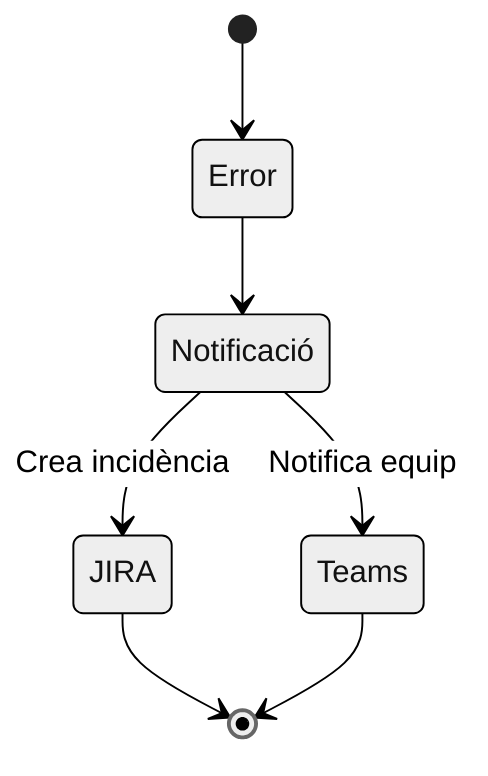
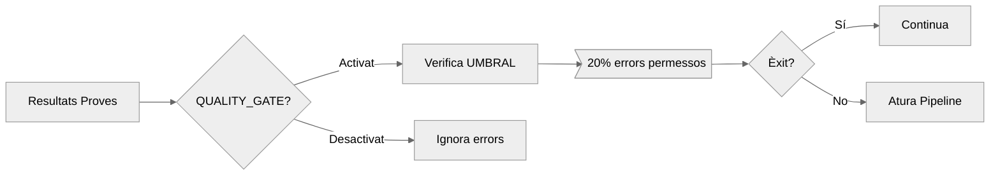
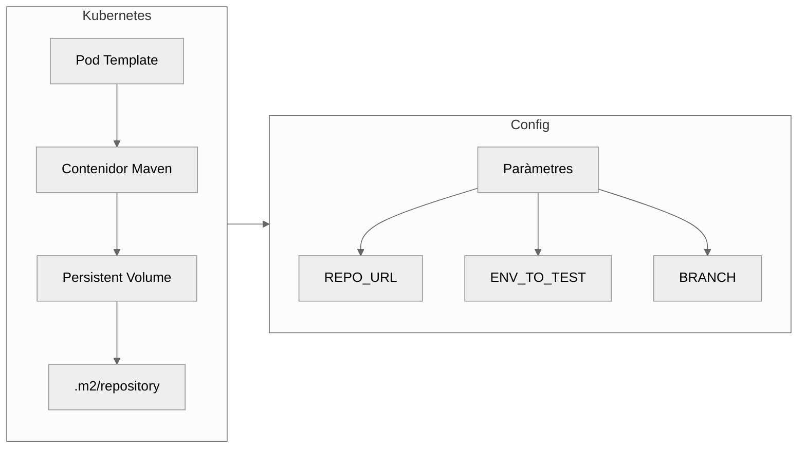
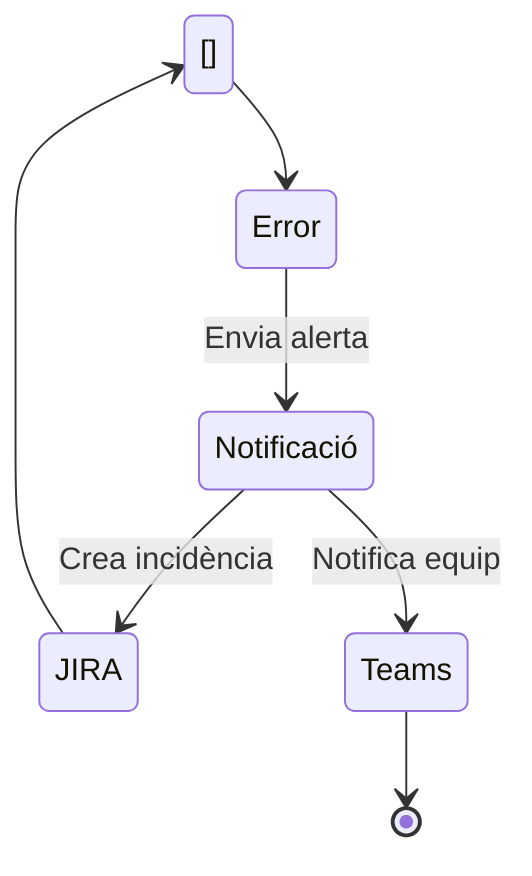

# Pipeline d'Integració Contínua MAT { .md-typeset }

{ align=right width="300" }

## Descripció General
Aquest pipeline Jenkins automatitza l'execució de proves funcionals integrat al Marc d'Automatització de Testing (MAT) del CTTI.

<div class="grid cards" markdown>

-   :material-git: __Integració amb GitHub__
-   :material-jira: __Sincronització amb JIRA__
-   :material-chart-line: __Mètriques en temps real__
-   :material-shield-check: __Quality Gates Integrats__

</div>

## Diagrama del Flux

```mermaid
%%{init: {'theme':'neutral'}}%%
sequenceDiagram
    participant Jenkins
    participant GitHub
    participant Kubernetes
    participant JIRA
    participant InfluxDB

    Jenkins->>GitHub: Clona repositori
    GitHub-->>Jenkins: Codi font
    Jenkins->>Kubernetes: Desplega Pod Maven
    Kubernetes-->>Jenkins: Confirmació
    Jenkins->>Jenkins: Executa proves Selenium
    Jenkins->>JIRA: Puja resultats TestNG
    Jenkins->>InfluxDB: Emmagatzema mètriques
    Jenkins->>GitHub: Notifica PR


## Paràmetres del Pipeline

| Paràmetre | Descripció | Valors Permesos |
|-----------|------------|-----------------|
| `REPO_URL` | Repositori de proves | URL GitHub vàlida |
| `ENV_TO_TEST` | Entorn de proves | Desenvolupament, Integració, Preproducció, Producció |
| `BRANCH` | Branca a provar | Nom de branca vàlid |
| `QUALITY_GATE` | Control de qualitat | true/false |

## Etapes Principals

### 1. Pipeline
```mermaid
%%{init: {'theme':'neutral'}}%%
flowchart TD
A([Inici]) --> B[Validació Paràmetres]
B --> C[Checkout Codi]
C --> D[Validar Issue JIRA]
D --> E[Executar Proves Maven]
E --> F[Pujar Resultats JIRA]
F --> G[Publicar Informe HTML]
G --> H[Pujar Informe JIRA]
H --> I{{QUALITY_GATE?}}
I -->|Activat| J[Avaluar Umbral]
I -->|Desactivat| K[Saltar Control]
J --> L{Errors < UMBRAL?}
L -->|Sí| M[Notificar Èxit]
L -->|No| N[Aturar Pipeline]
K --> M
M --> O[Adjuntar MD a GitHub PR]
N --> O
O --> P([Fi])
classDef stage fill:#4CAF50,stroke:#388E3C,color:white;
classDef decision fill:#FFC107,stroke:#FFA000;
classDef error fill:#F44336,stroke:#D32F2F,color:white;
class A,B,C,D,E,F,G,H,J stage
class I,L decision
class N error


```

### 2. Execució de Proves
??? tip "Tecnologies Utilitzades"
    - Selenium per a proves funcionals
    - Maven com a gestor de dependències
    - Extent per a informes executives


### 3. Gestió de Resultats

| Eina | Funció | Integració |
|------|--------|------------|
| JIRA | Pujada de resultats | Xray Test Management |
| GitHub | Vinculació a PRs | Comentaris automàtics |
| InfluxDB | Emmagatzematge mètriques | Grafana Dashboards |


### 4. Gestió de d'Errors


### 6.  Flux de Qualitat (Quality Gate)


### 5. Diagrama de Configuració del Entorn




## Qualitat i Seguretat

!!! danger "Control d'Errors"
    El pipeline inclou mecanismes avançats de gestió d'errors:
    - Validació de tickets JIRA
    - Avaluació de llindars d'error
    - Notificacions multi-canal



## Integració amb Ecosistema MAT

<div class="grid cards" markdown>

-   [Documentació Tècnica](https://ctti.gencat.cat/mat-docs){ .md-button }
-   [Exemples d'Implementació](../examples){ .md-button }
-   [Guia de Troubleshooting](../troubleshooting){ .md-button }

</div>
