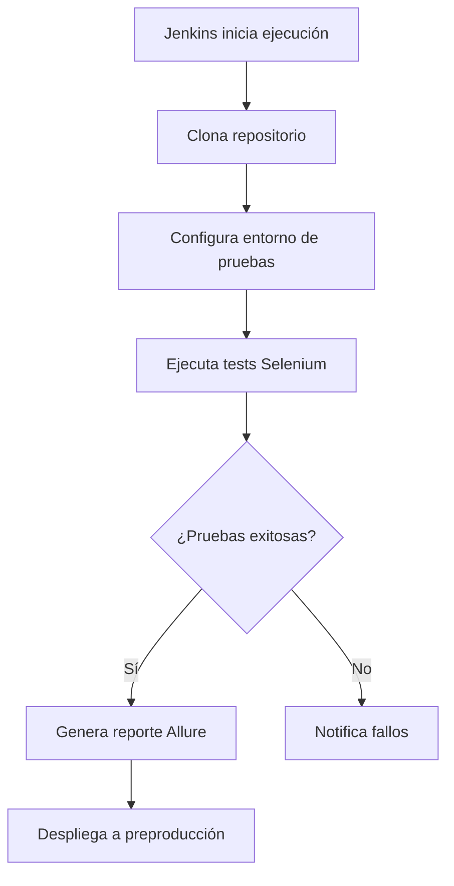

# Automatización de Pruebas con Selenium

- :material-web: Compatibilidad multi-navegador
- :material-robot: Framework de testing web
- :material-chart-line: Integración CI/CD

## Flujo de Trabajo en MAT

### Implementación
1. **Configuración de Entorno**:
   - Instalar drivers específicos para cada navegador
   - Configurar Jenkins para ejecución paralela

2. **Desarrollo de Pruebas**:
   - Crear scripts usando Page Object Model
   - Implementar validaciones de UI/UX

3. **Integración Continua**:
   - Programar ejecución nocturna en Jenkins
   - Configurar triggers ante cambios en repositorio

4. **Reportes**:
   - Generar dashboards interactivos con Allure
   - Integrar métricas de cobertura de pruebas

---

{ align=right width=300 }

### Ventajas Clave
- Pruebas cross-browser automatizadas
- Detección temprana de regresiones visuales
- Soporte para múltiples lenguajes (Java, Python, C#)
