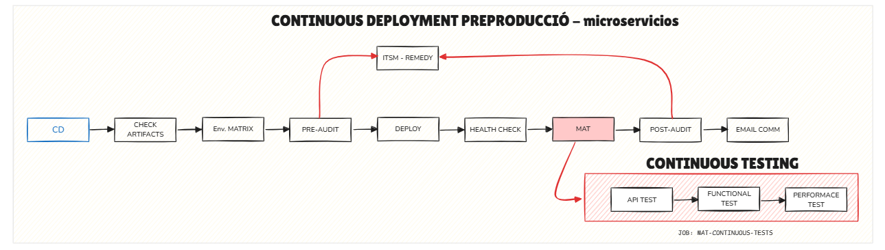

# MAT - Continuous Deployment i Testing

## Header

### Navegación
- [Confluence](https://totgencat.atlassian.net/wiki/spaces/DEVSECOPS/overview?homepageId=50037232)
- [Jira](https://cstd-ctti-sandbox-198.atlassian.net/jira/software/c/projects/DEVSECOPS2/boards/399)
- [Azure](https://portal.azure.com)
- [Github](https://github.com/enterprises/gencat)
- [Qualitat](https://qualitat.solucions.gencat.cat/)

## Procés de Testing
- [API Testing](api-testing.html)
- [Functional Testing](functional-testing.html)
- [Performance Testing](performance-testing.html)

## Continuous Deployment Preproducció - Microserveis

### Fases del Procés
1. **Inici del Desplegament (CD)**
   Punt d'entrada del procés de desplegament continu. S'inicia automàticament quan es detecten canvis al repositori.

2. **Verificació d'Artefactes**
   Comprovació dels components necessaris pel desplegament, assegurant que tots els artefactes estiguin disponibles i siguin vàlids.

3. **Configuració de l'Entorn**
   Preparació de la matriu d'entorns necessària pel desplegament, configurant les variables i dependències específiques.

4. **Auditoria Prèvia**
   Avaluació de seguretat i compliment normatiu abans del desplegament per identificar possibles riscos.

5. **Desplegament**
   Execució del procés de desplegament dels microserveis a l'entorn corresponent.

6. **Verificació de Salut**
   Comprovació de l'estat dels serveis després del desplegament, verificant la seva disponibilitat i funcionament correcte.

7. **Testing Automatitzat (MAT)**
   Execució de les proves automatitzades utilitzant el Marc d'Automatització de Testing:
   - **Proves d'API:** Validació dels endpoints i integracions
   - **Proves Funcionals:** Verificació del comportament esperat
   - **Proves de Rendiment:** Avaluació del rendiment sota càrrega

8. **Auditoria Posterior**
   Verificació final de seguretat i qualitat després del desplegament i les proves.

9. **Comunicació**
   Notificació automàtica dels resultats del desplegament i les proves als interessats via correu electrònic.

10. **Gestió d'Incidències (ITSM - REMEDY)**
    Sistema integrat de gestió d'incidències que s'activa automàticament en cas de detectar problemes durant qualsevol fase del procés.

