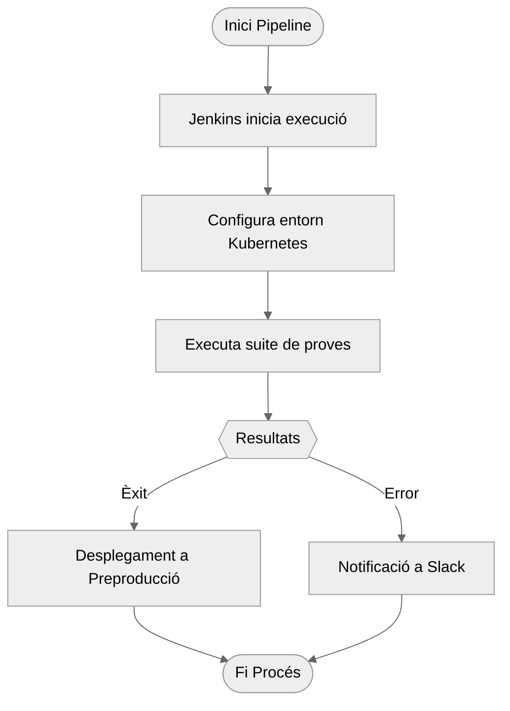

# Automatització de Proves amb Selenium { .md-typeset }

<div class="hero" markdown>

## :simple-selenium: Eina Clau per a Qualitat Web

El MAT integra Selenium com a peça fonamental per garantir el funcionament correcte de les aplicacions web mitjançant proves funcionals automatitzades.

[Veure Pipeline :material-arrow-right-circle:](../mat/pipeline.md){ .md-button }
[Documentació Tècnica](https://www.selenium.dev){ .md-button .md-button--primary }

</div>

<div class="grid cards" markdown>

-   :material-web-check:{ .lg .middle } __Multiplataforma__
    
    ---
    
    Compatibilitat amb Chrome, Firefox, Edge i Safari
    
-   :material-robot:{ .lg .middle } __Patró Page Object__
    
    ---
    
    Estructura modular i reutilitzable per a manteniment fàcil
    
-   :material-chart-timeline-variant:{ .lg .middle } __Integració CI/CD__
    
    ---
    
    Execució automàtica mitjançant Jenkins i Extent Reports

</div>

## Flux de Treball al MAT { #workflow }



### :material-cog: Configuració

??? success "Requisits Previs"
    1. Instal·lar WebDrivers específics
    2. Configurar nodes Selenium Grid
    3. Integrar amb repositori Git del projecte

```
class LoginPage:
def init(self, driver):
self.driver = driver
self.username = (By.ID, "username")
self.password = (By.ID, "password")
def login(self, user, passw):
    self.driver.find_element(*self.username).send_keys(user)
    self.driver.find_element(*self.password).send_keys(passw)
    self.driver.find_element(By.XPATH, "//button[@type='submit']").click()
```

### :material-test-tube: Execució de Proves

<div class="grid" markdown>

!!! tip "Millors Pràctiques"
    - Ús de waits explicites
    - Proves independents i aïllades
    - Captura d'evidències en fallades

{ align=right width="400" }

</div>

#### Flux d'Execució
1. **Inicialització**  
   :material-docker: Configuració de contenidors Kubernetes
2. **Execució**  
   :material-play: Tests en paral·lel amb Grid
3. **Validació**  
   :material-check-all: Assertions múltiples per cas
4. **Report**  
   :material-file-chart: Generació d'informes Extent

### :material-chart-box: Mètriques Clau

| Indicador | Descripció | Objectiu |
|-----------|------------|---------|
| :material-speedometer: Temps Execució | Durada total de les proves | < 15 min |
| :material-bug: Taxes d'Error | Proves fallides/totals | 0% |
| :material-coverage: Cobertura | % funcionalitats provades | > 90% |

<div class="grid cards" markdown>

-   [Veure Exemples Complets](../examples/selenium){ .md-button .md-button--primary }
-   [Configurar Jenkins](../guides/jenkins-setup.md){ .md-button }

</div>


