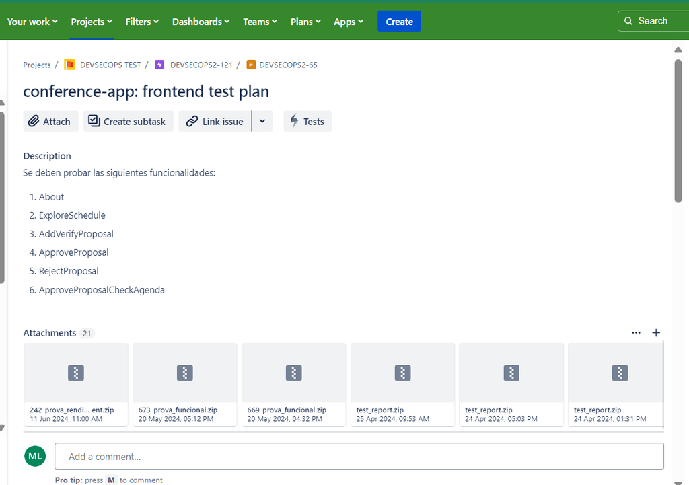
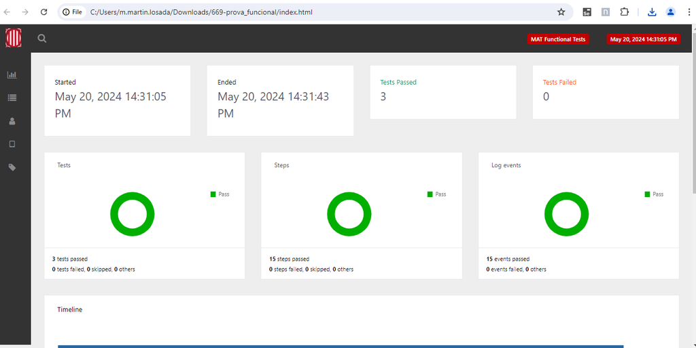
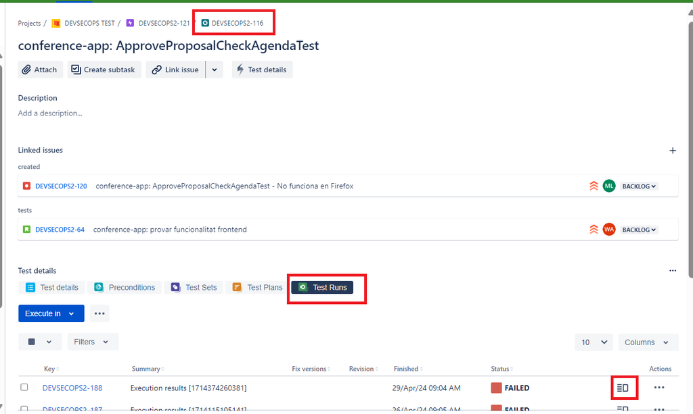
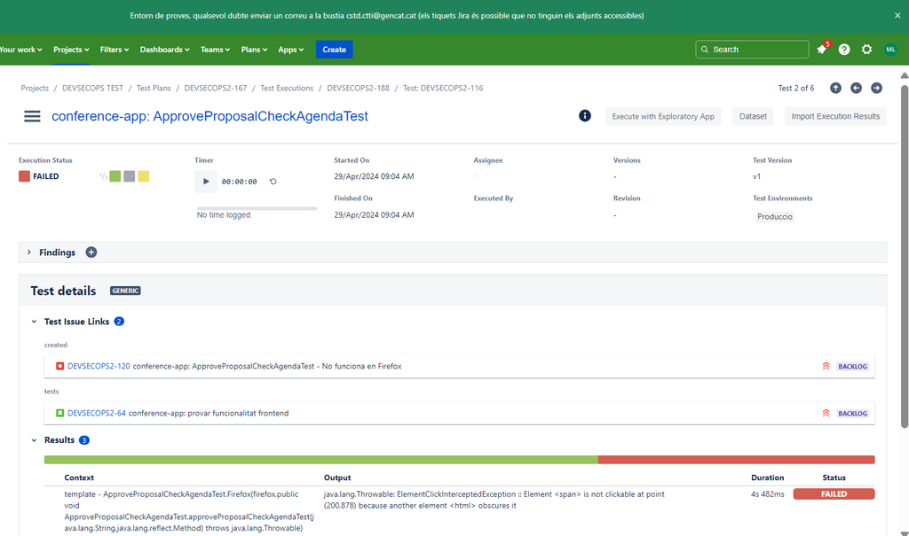
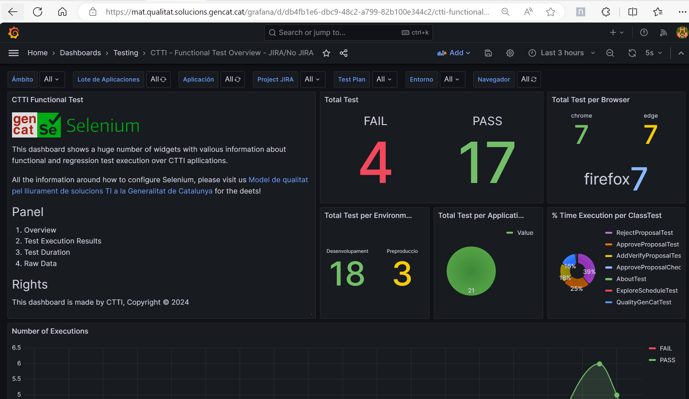

# Proveïdors i Configuració del MAT

Aquest document descriu els requeriments, procediments d’instal·lació i ús del MAT (Marc d'Automatització de Testing) utilitzant Docker Compose i la configuració "Standalone", així com les instruccions per a la creació i execució de proves i la integració amb Jira.

---

## Proveïdors i Requisits

### Proveïdors

- **Local**

### Requisits Bàsics

- **Instal·lar Docker**:  
  Recomanat [Docker Desktop: The #1 Containerization Tool for Developers](https://www.docker.com/).

- **Instal·lar JDK**:  
  [Download the Latest Java LTS Free](https://www.oracle.com/java/technologies/javase-downloads.html).

---

## Instal·lació amb Docker Compose (Recomanat)

### Instruccions per aixecar la infraestructura

Crea un fitxer anomenat `docker-compose.yaml` al directori del projecte amb el següent contingut:
```
version: "3"
services:
selenium-hub:
image: selenium/hub
container_name: selenium-hub
ports:
- "4442:4442"
- "4443:4443"
- "4444:4444"
chrome:
image: selenium/node-chrome
shm_size: 2gb
depends_on:
- selenium-hub
environment:
- SE_EVENT_BUS_HOST=selenium-hub
- SE_EVENT_BUS_PUBLISH_PORT=4442
- SE_EVENT_BUS_SUBSCRIBE_PORT=4443
- SE_NODE_MAX_INSTANCES=1
- SE_NODE_MAX_SESSIONS=1
edge:
image: selenium/node-edge
shm_size: 2gb
depends_on:
- selenium-hub
environment:
- SE_EVENT_BUS_HOST=selenium-hub
- SE_EVENT_BUS_PUBLISH_PORT=4442
- SE_EVENT_BUS_SUBSCRIBE_PORT=4443
- SE_NODE_MAX_INSTANCES=1
- SE_NODE_MAX_SESSIONS=1
firefox:
image: selenium/node-firefox
shm_size: 2gb
depends_on:
- selenium-hub
environment:
- SE_EVENT_BUS_HOST=selenium-hub
- SE_EVENT_BUS_PUBLISH_PORT=4442
- SE_EVENT_BUS_SUBSCRIBE_PORT=4443
- SE_NODE_MAX_INSTANCES=1
- SE_NODE_MAX_SESSIONS=1
```

### Com aixecar el servei

- Executar el següent comandament per iniciar tota l'arquitectura amb Docker Compose:

```
docker-compose -f docker-compose.yaml up -d --scale chrome=3 --scale firefox=3 --scale edge=1
```

Els nombres indicats per cada navegador representen el nombre de nodes (contenidors) per a cada navegador.

- Per comprovar els contenidors aixecats:

```
docker container ls
```

- **Accedir a la WebUI de Selenium Grid:**  
  [http://localhost:4444/ui](http://localhost:4444/ui)

- Per eliminar els serveis aixecats:

```
docker-compose -f docker-compose.yaml down
```


---

## Cas d'Ús Sense Docker – Configuració en Màquina "Standalone"

Si prefereixes executar Selenium sense Docker, segueix aquests passos:

1. **Baixa Selenium Server (Grid)**  
   Ves a la secció [Downloads de Selenium](https://www.selenium.dev/downloads/) i obté la versió compatible amb Chrome, Firefox i Edge.

2. **Baixa els Controladors Web**  
   - **Chrome WebDriver:**  
     [ChromeDriver](https://sites.google.com/chromium.org/driver/)  
   - **Firefox WebDriver:**  
     [Geckodriver Releases](https://github.com/mozilla/geckodriver/releases)  
   - **Edge WebDriver:**  
     [Microsoft Edge WebDriver](https://developer.microsoft.com/en-us/microsoft-edge/tools/webdriver/)

3. **Execució en Mode Standalone**

   Després d'obtindre el fitxer `selenium-server-<version>.jar`, obre un terminal, situa't al directori on es troba el JAR i executa:

```
java -jar selenium-server-4.10.0.jar standalone
```

Un cop en marxa, connecta amb la URL:  
[http://localhost:4444/ui](http://localhost:4444/ui)

---

## Creació i Execució de Proves

### Requisits per a les Proves

Assegura’t de tenir configurats Java i Maven al teu sistema. Pots comprovar-ho amb:

```
java -version
mvn -v
```

### Pas a Pas

1. **Descàrrega la plantilla de proves funcionals:**

   - Accedeix al repositori de la 【Plantilla de proves funcionals】(enllaç al repositori).

2. **Configuració de l'entorn:**

   Editeu el fitxer de propietats, per exemple, `functional-test/config.properties`, afegint:
   
```
app = ...
maintainer = ...
app_url = ...
ambit = ...
text
```

3. **Creació de les proves:**

Crea les proves en el fitxer `functional-test/src/test/java/<file_name>.java`.

4. **Execució de les proves:**

Utilitza Maven per executar les proves amb la següent ordre:

```
mvn clean test -Dselenium_url="http://localhost:4444/wd/hub" 
-Dapp_url="https://qualitat.solucions.gencat.cat"
```


El paràmetre `-Dapp_url="..."` ha d'indicar la URL de l'aplicació, en aquest cas: `https://qualitat.solucions.gencat.cat`.

5. **Informe de Resultats:**

Després de l'execució, trobareu l'informe de resultats a `extentreport/extent-report.html`.

---

## Integració amb Jira i Execució des de MAT

Els proveïdors poden executar les proves directament des del pla de proves de Jira, ja que està connectat amb el Job de Jenkins:

- **Job de Jenkins:**  
`MAT-PROVES-FUNCIONAL-SELENIUM`

- **Paràmetres necessaris:**

| Paràmetre                 | Descripció                                                                |
|---------------------------|---------------------------------------------------------------------------|
| repositori de codi font   | URL on estan allotjades les proves funcionals                             |
| entorn                    | Entorns per a fer les proves                                              |
| branca                    | Branca del repositori de proves                                          |
| urlapp                    | URL de l'aplicació                                                        |
| llindar de QG             | Límit de fallades acceptat                                               |
| JIRA_PROJECT_KEY          | Project Key de Jira                                                       |
| JIRA_ISSUE_KEY            | Test Plan Key de Jira                                                     |

- **Accedir al pla de proves en Jira:**  
A la interfície de Jira apareixeran imatges i paràmetres (per exemple, "Jira Plan de proves").  
*(Es poden incloure captures d'imatge referenciant les diferents vistes: pla de proves, paràmetres, test runs, dashboards, etc.)*

---

## Visualització dels Resultats

### Informe HTML de Proves Funcionales
Aquest document HTML prové de la llibreria Extent Report, i conté les execucions detallades.

{ align=left width="800" }  
<figcaption>Diagrama del procés de Continuous Deployment</figcaption>
{ align=right width="800" }  
<figcaption>Diagrama del procés de Continuous Deployment</figcaption>

### Integració amb Jira
Els resultats es poden visualitzar dins del test plan de Jira, amb adjunts als tests i l’estat dels test runs.

{ align=left width="800" }  
<figcaption>Diagrama del procés de Continuous Deployment</figcaption>
{ align=right width="800" }  
<figcaption>Diagrama del procés de Continuous Deployment</figcaption>

### Taulers de Monitoratge
També es pot consultar l'estat general del projecte en taulers com els de Jira Dashboard i Grafana.

{ align=center width="800" }  
<figcaption>Diagrama del procés de Continuous Deployment</figcaption>

> **Nota:** Comproveu sempre la compatibilitat de versions entre els navegadors i els controladors web. Actualitzeu els paràmetres segons les necessitats del vostre entorn de proves.

---

### Diagrama de Flux de Selenium Grid

```mermaid
%%{init: {'theme':'neutral'}}%%
flowchart LR
    A[Docker Compose: Selenium Hub]
    B[Nodes Chrome (3)]
    C[Nodes Firefox (3)]
    D[Nodes Edge (1)]
    E[Selenium Grid WebUI]
    F[Execució de Proves]
    
    A --> B
    A --> C
    A --> D
    B --> E
    C --> E
    D --> E
    E --> F

```